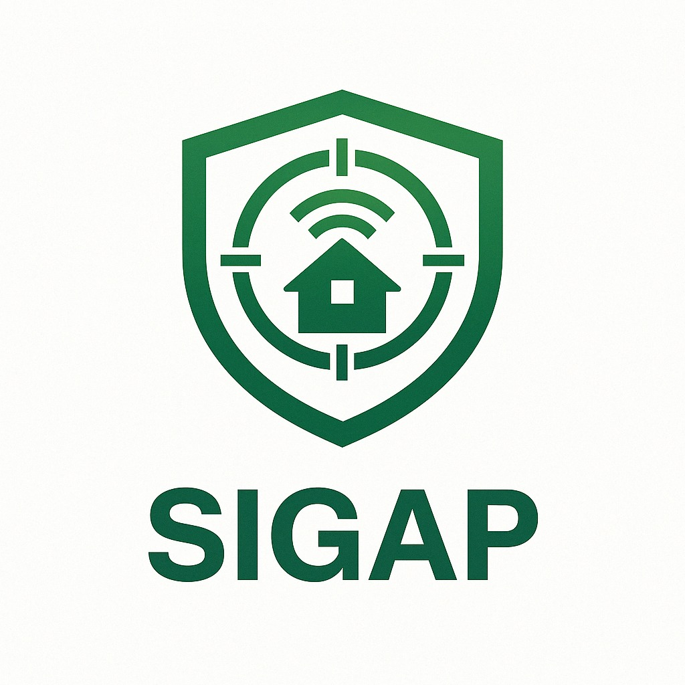

# Project Overview
 
**SIGAP (Sistem Intelijen Garda Aman Pintar)** adalah suatu sistem pemantauan yang dilengkapi dengan AI untuk mendeteksi hal-hal mencurigakan dan melaporkannya secara langsung. Sistem ini menggunakan kamera dan esp32 untuk saling berkomunikasi dan dilengkapi dengan dashboard menggunakan streamlit dan ubidots.

# Hardware
- Webcam
- ESP32
- Buzzer
- Led

# Software
- YOLO untuk deteksi dan train model deteksi
- Ubidots untuk dashboard
- Streamlit untuk dashboard dengan ekstra fitur
- Python-3.10

# Technology Used
- OpenCV
- YOLO
- Supervision
- MQTT
- Face Recognition
- MongoDB